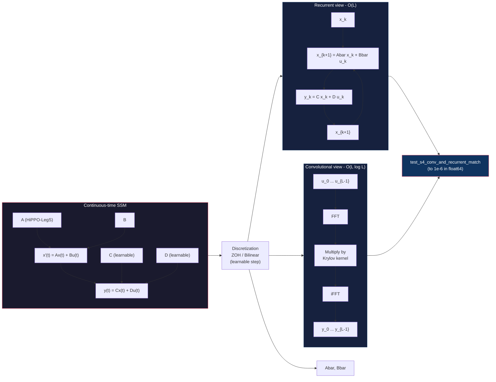
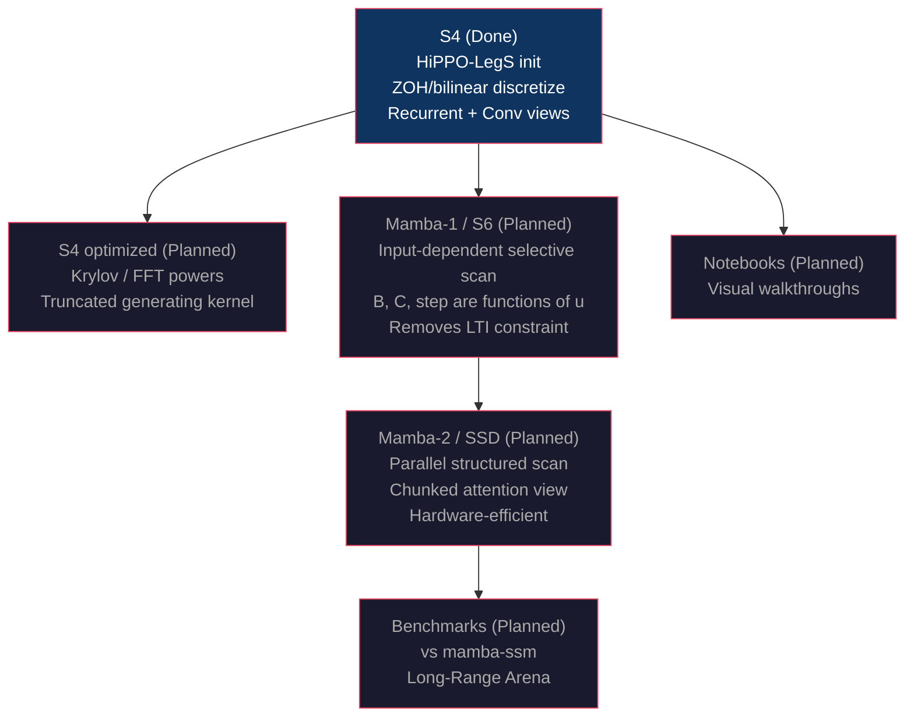

<p align="center">
  
</p>

# mamba-from-scratch

A clear, well-tested, from-scratch implementation of structured state-space models (S4, Mamba-1/S6, Mamba-2/SSD) in pure PyTorch.

Most existing implementations optimize for speed and skip the math. This project optimizes for **clarity**: every component is derived from first principles, both computational views (recurrent and convolutional) are implemented side by side, and the central theoretical guarantees are verified by tests.

## Why

State-space models (SSMs) are the family behind Mamba, Jamba, and a growing share of efficient sequence models. They are subtle: the same equation supports a slow recurrent form and a fast parallel form, and the two must agree. Understanding that duality, the HiPPO initialization that gives SSMs long-range memory, and the selective scan that makes Mamba input-dependent, requires reading code that is honest about both the math and the numerics. That is what this repo provides.

## Status

| Component | Status | Description |
|-----------|--------|-------------|
| S4 | Done | HiPPO-LegS matrix, ZOH/bilinear discretization, recurrent + convolutional views |
| S4 (optimized) | Planned | Truncated generating kernel via Krylov / FFT powers |
| Mamba-1 (S6) | Planned | Input-dependent selective scan |
| Mamba-2 (SSD) | Planned | Parallel structured scan via chunked attention |
| Notebooks | Planned | Visual walkthrough of each component |
| Benchmarks | Planned | vs `mamba-ssm` on Long-Range Arena |

## Architecture

The S4 layer's central insight is that the same state-space model supports two
equivalent computational views. This duality is what makes SSMs both parallel-trainable
and autoregressive-efficient:



The implementation roadmap from S4 to Mamba-2, showing how each model builds on
the previous:



## The S4 layer

The S4 layer from [Gu, Goel, Re (2022)](https://arxiv.org/abs/2111.00396) implements the continuous-time state-space model

```
x'(t) = A x(t) + B u(t)
y(t)  = C x(t) + D u(t)
```

discretized to

```
x_{k+1} = Abar x_k + Bbar u_k
y_k     = C x_k   + D u_k
```

The same model supports two equivalent computational views:

1. **Recurrent** (step-by-step): O(L) time, used for autoregressive generation
2. **Convolutional** (FFT-based): O(L log L) time, used for parallel training

Both views produce identical outputs. This is the central theorem of S4 and is verified by `test_s4_conv_and_recurrent_match` to 1e-6 in float64.

### Key components

- `hippo_legs(N)`: the HiPPO-LegS matrix A, the structured initialization that gives S4 its long-range memory
- `zoh_discretize` / `bilinear_discretize`: continuous-to-discrete conversion with gradient flow through the learnable step size
- `S4Layer`: a PyTorch `nn.Module` with learnable C, D, and log-step; supports both `mode="conv"` and `mode="recurrent"`

### Install

```bash
git clone https://github.com/sailikhithk/mamba-from-scratch.git
cd mamba-from-scratch
python -m venv .venv && source .venv/bin/activate
pip install torch numpy pytest
```

### Run the tests

```bash
PYTHONPATH=src python -m pytest tests/ -v
```

13 tests pass, covering:

- HiPPO-LegS matrix structure, diagonal, off-diagonal, and stability
- Discretized Abar eigenvalues inside the unit disk across step sizes
- Output shape correctness for both views
- Recurrent and convolutional views produce identical outputs
- Gradient flow through C, D, and log_step
- Long sequence (L=1024) produces no NaNs

### Quick smoke test

```bash
PYTHONPATH=src python scripts/smoke_test.py
```

## Project structure

```
mamba-from-scratch/
  pyproject.toml
  src/
    s4/
      hippo.py    # HiPPO-LegS matrix + ZOH / bilinear discretization
      layer.py    # S4Layer: recurrent + convolutional views
    mamba1/       # (planned) S6 selective scan
    mamba2/       # (planned) SSD parallel scan
  tests/
    test_s4.py
  scripts/
    smoke_test.py
  notebooks/      # (planned) visual walkthroughs
  docs/
    RESEARCH.md   # landscape survey of existing implementations
  benchmarks/     # (planned) vs mamba-ssm
```

## Design principles

- **Honest numerics.** No silently deactivating gradients, no `.item()` that detaches the graph, no flipped-kernel tricks without explanation. The two bugs that broke the first version of this code (both caught by the test suite) are documented in the commit history.
- **Two views, one truth.** Every SSM layer ships with both the recurrent and the convolutional implementation, and a test that they agree. If you can only read one, read the recurrent one; if you can only trust one, trust the test.
- **Minimal dependencies.** Pure PyTorch plus NumPy. No `mamba-ssm`, no `causal-conv1d`, no Triton. The point is to see the math.
- **Tested before optimized.** The naive O(L^2) convolution path is kept alongside the FFT path so correctness can be checked independently of speed.

## References

- Gu, Goel, Re. "Efficiently Modeling Long Sequences with Structured State Spaces." ICLR 2022. https://arxiv.org/abs/2111.00396
- Gu, Dao. "Mamba: Linear-Time Sequence Modeling with Selective State Spaces." 2023. https://arxiv.org/abs/2312.00752
- Dao, Gu. "Transformers are SSMs: Generalized Models and Parallel Algorithms." 2024. https://arxiv.org/abs/2405.21060
- HiPPO: Gu, Dao, Ermon, Rudra, Re. "HiPPO: Recurrent Memory with Optimal Polynomial Projections." NeurIPS 2020. https://arxiv.org/abs/2008.07669

## License

MIT

---

## About the author

**Sai Likhith Kanuparthi** is a Senior AI Infrastructure & Systems Engineer
at Airbnb. MS Computer Science from NYU. Published research on state-space
models and parameter-efficient adapters (Cambridge Scholars chapter).

- **GitHub:** [github.com/sailikhithk](https://github.com/sailikhithk)
- **LinkedIn:** [linkedin.com/in/sailikhithk](https://www.linkedin.com/in/sailikhithk)
- **Portfolio:** [sailikhith.me](https://sailikhith.me)
- **Other open-source projects:**
  - [Synthetic-AI-Image-Detector](https://github.com/sailikhithk/Synthetic-AI-Image-Detector) - Multi-signal deepfake detection with calibration
  - [llm-production-engineering](https://github.com/sailikhithk/llm-production-engineering) - Field notes on LLM serving in production

---

## Keywords

`Sai Likhith Kanuparthi` `Mamba from Scratch` `S4` `Mamba-1` `Mamba-2` `SSD`
`state space models` `SSM` `HiPPO` `selective scan` `structured state space`
`PyTorch` `sequence modeling` `efficient inference` `Mamba` `Jamba`
`recurrent neural networks` `convolutional view` `parallel scan`

